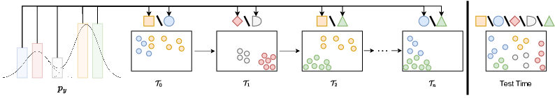
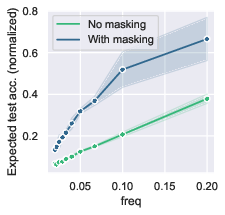
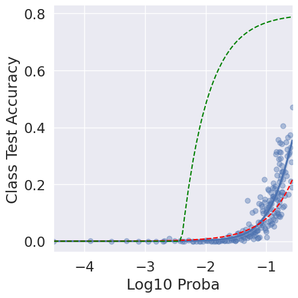

# Official Code for "Challenging Common Assumptions about Catastrophic Forgetting and Knowledge Accumulation", CoLLas 2023


## Abstract

Building learning agents that can progressively learn and accumulate knowledge is the core goal
of the continual learning (CL) research field. Unfortunately, training a model on new data usually
compromises the performance on past data. In the CL literature, this effect is referred to as catastrophic
forgetting (CF). CF has been largely studied, and a plethora of methods have been proposed to address
it on short sequences of non-overlapping tasks. In such setups, CF always leads to a quick and
significant drop in performance in past tasks. Nevertheless, despite CF, recent work showed that
SGD training on linear models accumulates knowledge in a CL regression setup. This phenomenon
becomes especially visible when tasks reoccur. We might then wonder if DNNs trained with SGD or
any standard gradient-based optimization accumulate knowledge in such a way. Such phenomena
would have interesting consequences for applying DNNs to real continual scenarios. Indeed, standard
gradient-based optimization methods are significantly less computationally expensive than existing
CL algorithms. In this paper, we study the progressive knowledge accumulation (KA) in DNNs trained
with gradient-based algorithms in long sequences of tasks with data re-occurrence. We propose a new
framework, SCoLe (Scaling Continual Learning), to investigate KA and discover that catastrophic
forgetting has a limited effect on DNNs trained with SGD. When trained on long sequences with data
sparsely re-occurring, the overall accuracy improves, which might be counter-intuitive given the CF
phenomenon. We empirically investigate KA in DNNs under various data occurrence frequencies
and propose simple and scalable strategies to increase knowledge accumulation in DNNs.

## Main Contributions

The main contribution of this work is to show precisely that the effect of catastrophic forgetting is limited on deep neural networks (DNNs)
and that it does not prevent knowledge accumulation. 
Secondly, it proposes an evaluation framework (SCoLe) to study the knowledge accumulation in DNNs at scale.

We hope that this benchmark will help to design the continual algorithms that could be efficient and deployable.


## SCoLe

SCoLe (Scaling Continual Learning) is a continual learning framework for generating long sequences of tasks with various
frequencies of tasks and classes. It is made to study the knowledge accumulation capability of learning algorithms.
The scenario is generated from a fixed datasets, then each task is generated online by randomly selecting a subset of classes
or data point.

By training and long sequences of automatically generated tasks can can visualize progress (knowledge accumulation)
by plotting evaluation of accuracy on the test set composed of all classes.




We can control the probability of sampling classses to control there frequency of appearance in the sequence of task.
As such we can visualize knowledge accumulation with respect to classes frequency of appearances:

When all classes are sampled with the same frequency (balanced distribution):



or when all classes are sampled with different distribution:





The influence of various design choices, such as hyper-parameters,
can then be evaluated to know which composition lead to the best knowledge accumulation.

## Installation
```bash
pip install -r requirement.txt
```


## Examples of runs

Here is some example of runs to play with the code base.
If you are looking for the exact configuration to reproduce one figure of the paper do not hesitate to contact us.

One run with MNIST, 2 classes per task, 1 epoch per task,500 tasks using group masking on Adam optimization. (estimated duration ~20mins)
```bash
python main.py --wandb_id $YOUR_WANDB_ID  --classes_per_task=2 --dataset=MNIST --masking=group --momentum=0 --nb_epochs=1 --classes_per_task=2 --num_classes=10 --num_tasks=500 --optim=Adam
```

One run with 100 classes of TinyImagenet with random pertubation (severity 1), imbalanced class distribution by factor 2 (param: entropy_decrease), 1 epoch per task, 10 classes per task, 2500 tasks using group masking on SGD optimization and no momentum. (estimated duration ~15hrs)
```bash
python main.py --wandb_id $YOUR_WANDB_ID --class_acc=True --classes_per_task=10 --dataset=Tiny --entropy_decrease=2 --lr=0.01 --masking=group --momentum=0 --nb_epochs=1 --num_classes=100 --num_tasks=2500 --optim=SGD --rand_transform=perturbations --severity=1
```

Same as above with frequency replay (by default frequency replay classes between frequency low_frequency=0.01 and high_frequency=0.1 ) (estimated duration ~16hrs)
```bash
python main.py --wandb_id $YOUR_WANDB_ID --class_acc=True --classes_per_task=10 --dataset=Tiny --entropy_decrease=2 --lr=0.01 --masking=group --momentum=0 --nb_epochs=1 --num_classes=100 --num_tasks=2500 --optim=SGD --rand_transform=perturbations --replay=frequency --severity=1
```


### Citing the Paper

```Array.<string>
@misc{Lesort2023Challenging,
  title = "{Challenging Common Assumptions about Catastrophic Forgetting and Knowledge Accumulation}",
  author={{Lesort}, Timoth{\'e}e and {Ostapenko}, Oleksiy and {Rodr{\'\i}guez}, Pau and {Misra}, Diganta and {Rifat Arefin}, Md and {Charlin}, Laurent and {Rish}, Irina},
  booktitle={Conference on Lifelong Learning Agents},
  year={2023},
  organization={PMLR}
}
```
